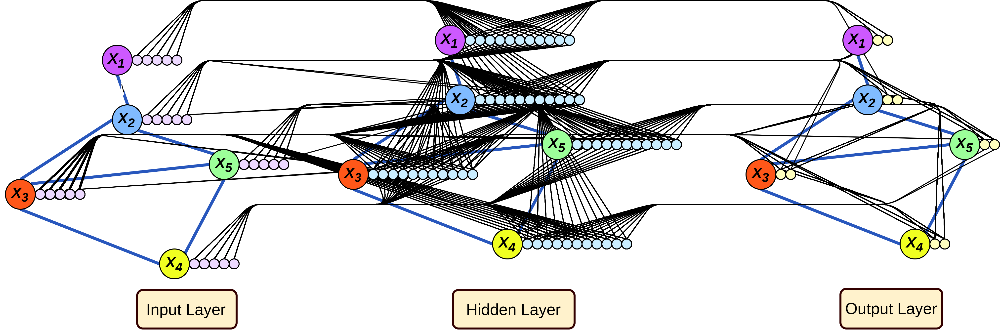

# Deep Generative Modeling For Networks

## Introduction
This repository contains for the code for the RAND Initiated Research (RIR) project "Deep Generative Modeling for Networks". The code consists of multiple Jupyter notebooks, each implementing a different workflow:
  1. `NDSSL Data Processing Notebook.ipynb`: loads and processes the NDSSL data used throughout the project. It also computes many statistical properties of this dataset and was used to generate the plots in Sec. 4 of the report.
  2. `Node Classification.ipynb`: implements a simple node classification example on the NDSSL dataset. This is presented in Sec. 5.1 of the report.
  3. `Link Prediction.ipynb`: implements a Graph Autoencoder (GAE) approach towards link prediction, again on the NDSSL dataset. This is presented in Sec. 5.2 of the report.
  4. `Graph Generation.ipynb`: implements the Graph Generation by Iterated Link Prediction approach towards generating artificial graphs. This code uses the results from running the link prediction notebook.
  5. `Generated Graph Analysis.ipynb`: analyzes and plots the results of running the graph generation notebook. Sec. 6 of the report contains the results of this notebook and the previous one.

These notebooks utilize a series of library functions, `imports.py`, `datasets.py`, `nodepred.py`, `linkpred.py` which handle the importing of packages, implement commonly used data manipulation algorithms, as well as the neural network models used in node prediction and link prediction problems.

Lastly, there is an R Markdown notebook included in the `ERGM Analysis` directory which was used to produce the results of Sec. 7.

Please direct any questions to <hartnett@rand.org>.



## Installation
The workflows are coded in Python, and heavily utilize [*Pytorch*](https://pytorch.org/) and [*Pytorch Geometric*](https://pytorch-geometric.readthedocs.io/en/latest/). These will need to be installed, along with the many other packages that are used. We recommend installing within a conda environment:

```
git clone https://github.com/randcorporation/dgmnet
cd dgmnet
conda create --name dgmnet
conda activate dgmnet
```

Next, [install Pytorch](https://pytorch.org/). The instructions for a CUDA 10.2 GPU is:

```
conda install pytorch torchvision cudatoolkit=10.2 -c pytorch
```

Then, install Pytorch Geometric:

```
pip install torch-scatter==latest+${CUDA} -f https://pytorch-geometric.com/whl/torch-${TORCH}.html
pip install torch-sparse==latest+${CUDA} -f https://pytorch-geometric.com/whl/torch-${TORCH}.html
pip install torch-cluster==latest+${CUDA} -f https://pytorch-geometric.com/whl/torch-${TORCH}.html
pip install torch-spline-conv==latest+${CUDA} -f https://pytorch-geometric.com/whl/torch-${TORCH}.html
pip install torch-geometric
```
where ${CUDA} and ${TORCH} should be replaced by your specific CUDA version (cpu, cu92, cu101, cu102, cu110) and PyTorch version (1.4.0, 1.5.0, 1.6.0, 1.7.0), respectively.

Finally, install the other packages via:
```
python setup.py install
```

Note: although this repository is not a package, we found it useful to install all the necessary dependencies in this way using a `setup.py` file.

### NDSSL Data
The code expects to find the NDSSL data in the parent directory. The website hosting this data seems to have been taken down, but RAND retains a copy of the data which can be made available upon request.
